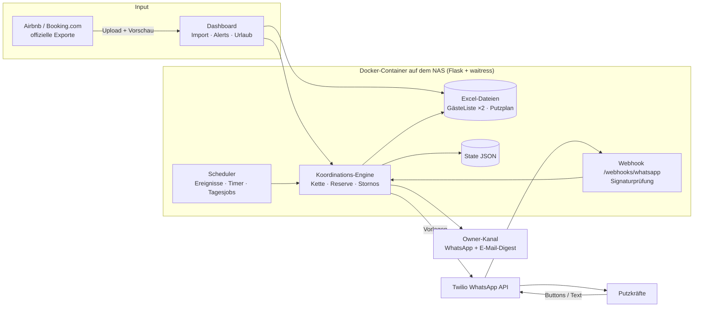

# Marktresidenz — Buchungs- und Reinigungs-Automatisierung

> **English TL;DR** — A production system I built and run for two small holiday
> apartments: it imports Airbnb/Booking.com exports into the owner's existing Excel
> workbooks without breaking their formulas, and coordinates the cleaning staff over
> **WhatsApp (Twilio)** — a priority/escalation chain with buttons, reserves,
> cancellations, reminders, leave rules, e-mail digests and cost/clock guards. Python
> (Flask), `openpyxl`, APScheduler, Docker on a home NAS. Live since October 2026.

Ein selbst entwickeltes, **im echten Betrieb laufendes** System für zwei
Ferienwohnungen (Marktresidenz Karlstraße und Eisenach). Es nimmt der Betreiberin die
wiederkehrende Handarbeit ab: Buchungen aus den Portal-Exporten in die bestehenden
Excel-Listen übernehmen, die Reinigungskräfte per WhatsApp einplanen, Erinnerungen und
Stornierungen verschicken und die Abrechnungsspalten nach der Reinigung ausfüllen.

Das Besondere: Es **ersetzt die Excel-Welt nicht**, sondern arbeitet in ihr. Die
Betreiberin pflegt ihre Dateien und Formeln weiter wie bisher — die Automatisierung
muss sich daran anpassen, nicht umgekehrt.

## Was das System kann

**Buchungen & Excel**
- Import der **offiziellen Exportdateien** von Booking.com (einfach/detailliert) und
  Airbnb (CSV, beide Varianten werden automatisch erkannt) mit Vorschau,
  Duplikat-Erkennung und Backup vor jedem Schreiben.
- Schreiben **ohne Formeln zu beschädigen**: nur anhängen, nie mitten im Blatt einfügen,
  Stornierungen werden markiert statt gelöscht (siehe *Entwurfsentscheidungen*).
- Alle Finanzspalten (S–BE) sind mit der Betreiberin Zelle für Zelle abgeglichen und
  hartkodiert — keine geratenen Formeln.
- Reinigungsplan (`Putzplan`) wird automatisch gepflegt: Auszugsdatum der vorherigen,
  Personenzahl der *nächsten* Buchung (die Putzkraft bereitet für die Ankommenden vor).
- Nach der Reinigung werden Putzkraft-Kürzel, Stunden und Lohn in die Abrechnung
  geschrieben (wöchentlich, nur wo noch Platzhalter stehen).

**Reinigungs-Koordination per WhatsApp**
- **Prioritätskette** je Objekt/Wochentag/Vertrag/Urlaub, faire Rotation der beiden
  Hauptkräfte, ab 3 Tagen Broadcast an alle noch Infrage-Kommenden.
- **Ja / Nein / Vielleicht per Button.** Nein, Vielleicht oder 1 h Schweigen → sofort die
  nächste Person. Antworten sind jederzeit änderbar; ein spätes „Ja" wird **Reserve** und
  rückt nach, wenn die bestätigte Person abspringt.
- **Stornierung & Ersatzbuchung:** Die zuständige Person wird um 19:00 am Vorabend
  informiert (nach 19:00 sofort, auch in der Ruhezeit); kommt danach eine Ersatzbuchung,
  wird dieselbe Person zuerst gefragt.
- Erinnerung am Vortag mit Gästezahl (Erwachsene, Kinder, Kinder unter 3), Ruhezeit
  22:00–08:00, harter und weicher Urlaub, Vertragsende-Warnung.
- Freitext/Sprachnachrichten der Putzkräfte werden an die Betreiberin weitergeleitet.
- **Dashboard:** „Suche starten", „Stornierung melden", „Putzkraft vorab zuweisen"
  (vor dem Import), Urlaubsverwaltung.

**Betrieb & Überwachung**
- Warnungen (⚠️) sofort per WhatsApp **und** E-Mail; Routine-Zeilen als Tages-E-Mail
  (18:00) bzw. live, solange das 24-h-Fenster offen ist.
- **Twilio-Kosten:** Monatsbericht per E-Mail und Warnung bei niedrigem Guthaben.
- **Uhren-Wächter**, der bei falscher Systemzeit warnt und das Senden sperrt.

## Architektur



## Entwurfsentscheidungen (die interessanten Stellen)

- **Kein Scraping.** Booking.com und Airbnb untersagen automatisierten/KI-gestützten
  Zugriff. Ein früher geplanter Roboter wurde verworfen; stattdessen werden die offiziellen
  Exporte importiert. Exportformate ändern sich ohne Ankündigung (Kodierung, Trennzeichen),
  der Parser erkennt die Varianten selbst.
- **Excel als Quelle der Wahrheit, mit `openpyxl` sicher beschrieben.** `openpyxl` passt
  Formel-Bezüge beim Einfügen nicht an — daher nur anhängen/in leere Zeilen schreiben.
  Putzplan (ohne Formeln) darf eingefügt werden. Stornos werden markiert; ein separates
  Code-Gedächtnis verhindert, dass ein von Hand gelöschter Eintrag beim nächsten Import
  wieder „neu" erscheint.
- **Atomare Dateizugriffe.** Nach einem echten Vorfall (ein Container-Neustart mitten in
  einem Speichern hatte eine Excel-Datei beschädigt; aus dem Backup wiederhergestellt)
  schreiben alle Speicherungen in eine Temp-Datei und ersetzen dann per `os.replace`;
  die Import-Bestätigung ist idempotent. Ein Post-Mortem steht in `docs/STATUS.md`.
- **Eskalation als reine Entscheidungsfunktion.** `decide_next_action(...)` verändert
  keinen Zustand und lässt sich deshalb vollständig mit simulierter Uhr und
  Attrappen-Sendern testen; ein Ausführungsschritt wendet die Aktion an.
- **Ereignisgesteuert statt Polling.** Jeder Anlass (Import, Antwort, Stornierung,
  Schweigen, Ruhezeit-Ende) löst genau die nötige Prüfung aus; Einmal-Timer werden nach
  jedem Neustart aus dem State neu aufgebaut. Dazu nur zwei Tagesjobs für zeitbasierte
  Schwellen (10-/3-Tage-Marke) und als Sicherheitsnetz.
- **WhatsApp-Realität.** Selbst initiierte Nachrichten brauchen von Meta freigegebene
  Vorlagen; Antworten innerhalb von 24 h dürfen Freitext sein. Das System trennt beides,
  hält Vorlagen kategorie-konform (Utility statt Marketing) und kontrolliert Kosten.
- **Sicher im Betrieb.** Trockenlauf und `SCHEDULER_ENABLED=0` sind Standard; ein
  Testmodus (`SCHEDULER_ONLY_CLEANERS`) isoliert Testpersonen von echten Daten;
  Webhook-Anfragen werden per Twilio-Signatur geprüft; Zeitwächter und Guthaben-Warnung
  verhindern stilles Fehlverhalten.
- **Kein „Stack um des Stacks willen".** Flask, `openpyxl`, APScheduler, JSON-State —
  bewusst klein, weil ein einzelner Prozess auf einem Heim-NAS läuft.

## Tests

Die Logik wurde mit Simulationen (simulierte Uhr, Attrappen-Sender, Kopien der echten
Excel-Dateien) und mit **echten Live-Tests** auf der WhatsApp-Sandbox geprüft: Ja/Nein/
Vielleicht, Schweigen mit Timer, Reserve und Absprung, Stornierung/Ersatzbuchung,
Erinnerung, Freitext-Weiterleitung. Bei diesen Tests wurden mehrere Fehler gefunden und
behoben (u. a. Signaturprüfung hinter Reverse-Proxy, eine Timer-Schleife, Namen vs. Kürzel
in der echten Datei). Details: `docs/STATUS.md` (Abschnitte 15–22).

## Technik

Python 3 · Flask · `openpyxl` · APScheduler · Twilio (WhatsApp, Content Templates) ·
`waitress` · Docker / Docker Compose auf einem QNAP-NAS (ARM) · Reverse-Proxy + TLS ·
Gmail-SMTP für E-Mail.

## Projektstruktur

```
app/
  excel_reader.py · xlsx_writer.py · import_parser.py · known_codes.py   Excel & Import
  putzplan_writer.py · post_clean.py                                      Reinigungsplan, Abrechnung
  cleaner_roster.py · cleaner_coordination.py · day_before.py             Kette, Antworten, Vortag/Storno
  whatsapp_sender.py · whatsapp_webhook.py                                Twilio-Anbindung
  scheduler.py · clock_guard.py · billing.py · owner_alerts.py            Betrieb & Überwachung
  checkin_reminder.py · notified_checkins.py                              Check-in-Erinnerung (E-Mail + .ics)
  routes.py · routes_workflow.py · templates/                             Dashboard
tools/        Vorlagen anlegen/einreichen, Excel-Aufräumer, Smoke-Tests
sample_data/  Frei erfundene Demo-Dateien (gleiche Struktur wie die echten)
docs/STATUS.md  Laufend gepflegter Übergabe- und Entscheidungsstand
Dockerfile · docker-compose.yml · wsgi.py
```

## Lokal ausprobieren

```bash
pip install -r requirements.txt
cp .env.example .env        # Zugangsdaten eintragen; Passwort-Hash:
python -c "from werkzeug.security import generate_password_hash; print(generate_password_hash('dein-passwort'))"
python run.py               # http://127.0.0.1:5000
```

Mit den Demo-Dateien: `DATA_DIR` auf `sample_data` zeigen lassen und die Dateinamen in
`app/config.py` anpassen. Der Scheduler und alle WhatsApp-/E-Mail-Versandwege sind
standardmäßig **aus**; mit `SCHEDULER_ENABLED=1` und `SCHEDULER_DRY_RUN=1` läuft alles
nur als Log („würde senden").

Wichtige Einstellungen (nur Namen, Werte stehen in `.env`, nie im Repo):
`ADMIN_USERNAME`, `ADMIN_PASSWORD_HASH`, `FLASK_SECRET_KEY`, `DATA_DIR`,
`TWILIO_ACCOUNT_SID`, `TWILIO_AUTH_TOKEN`, `TWILIO_WHATSAPP_FROM`, `TWILIO_WEBHOOK_URL`,
`OWNER_WHATSAPP_NUMBER`, `OWNER_DIGEST_EMAIL`, `GMAIL_USER`, `GMAIL_APP_PASSWORD`,
`SCHEDULER_ENABLED`, `SCHEDULER_DRY_RUN`, `TWILIO_LOW_BALANCE_USD`, `POST_CLEAN_SINCE`.

## Betrieb

Der Container läuft rund um die Uhr auf einem QNAP-NAS im eigenen Netz (Dauerbetrieb seit
2026-09-25): öffentlich über TLS und Reverse-Proxy erreichbar, die echten Excel-Dateien
liegen nur auf der eigenen Hardware (als Volume gemountet). Produktions-Einstieg ist
`wsgi.py` mit `waitress` (kein Debug-Modus). Eine Änderung wird per `docker compose up -d
--build` ausgerollt — nie, während ein Import läuft.

## Datenschutz & Sicherheit

- Keine Zugangsdaten, Telefonnummern oder Gästedaten im Repo: `.env`, `data/`, die echten
  Excel-Dateien, Backups und interne Planungsdokumente sind per `.gitignore`
  ausgeschlossen. Das Repo enthält nur Demo-Daten.
- Login mit Passwort-Hash, Webhook mit Signaturprüfung, Debug-Modus nur lokal.
- Jede berührte Excel-Datei wird vor dem Schreiben gesichert.

## Stand

Live seit 2026-10-05. Offen/als Nächstes: ein ansprechenderes Frontend (die Oberfläche
ist bewusst minimal), Erweiterungen der Abrechnung und Feinschliff an Vorlagen und
Berichten. Die komplette Entscheidungs- und Fehlerhistorie steht in `docs/STATUS.md`.
